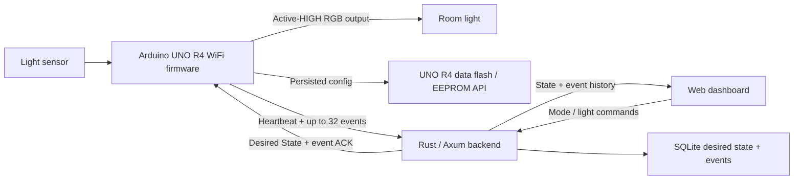
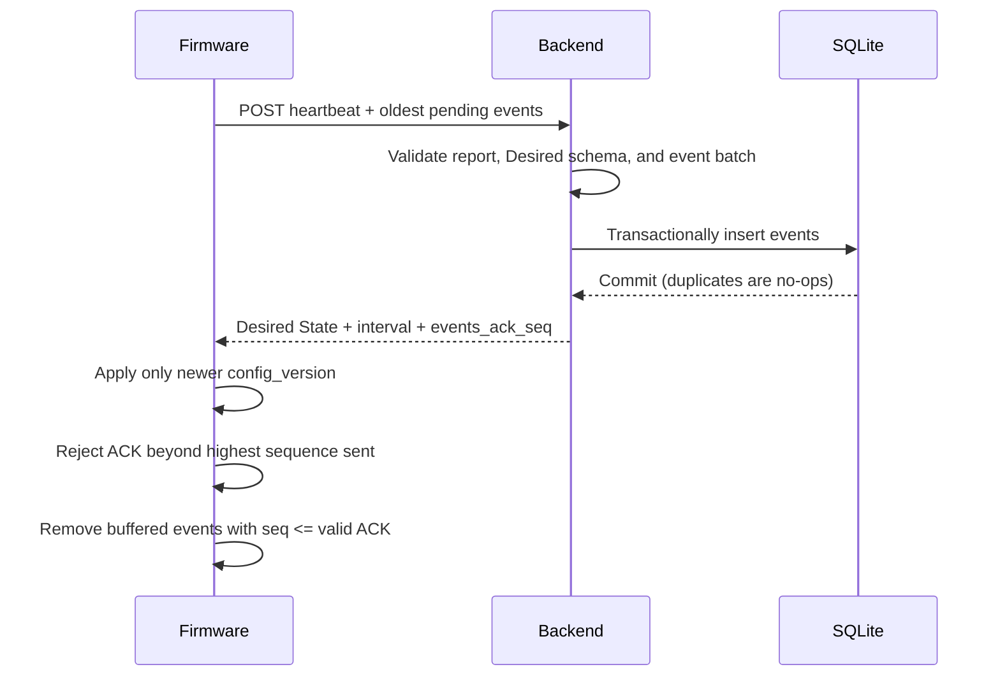

# LumaHome Architecture

LumaHome is a single-device, local-first lighting MVP. The
system has three runtime components: Arduino firmware, a Rust/Axum backend with
SQLite, and a framework-free browser dashboard served by that backend.

## Local-first behavior

Manual Mode and Night Mode execute on the Arduino. Manual Mode applies the
stored `manualLightOn` command. Night Mode filters the light sensor locally and
uses 250/350 hysteresis to derive the RGB output. Sensor sampling, RGB control,
Serial commands, deferred configuration saves, and mode logic do not depend on
Wi-Fi, the backend, or the dashboard.

The latest accepted mode, manual command, and backend configuration version
survive reset. Pending events survive Wi-Fi/backend outages because they remain
in a fixed RAM ring buffer, but they do not survive an Arduino reset.

## Component responsibilities

### Arduino firmware

- `LightController`: initializes and drives the active-HIGH RGB channels.
- `LightSensor`: takes 100 ms samples and maintains an eight-sample moving
  average with a running sum.
- `ModeController`: applies Manual/Night behavior and hysteresis.
- `ConfigStore`: validates, migrates, reads, and writes the versioned EEPROM
  configuration record.
- `NetworkManager`: issues Wi-Fi attempts, observes transitions, and schedules
  2/4/8/16/30-second reconnect backoff.
- `BackendClient`: schedules bounded heartbeats, creates HTTP requests, parses
  responses, and validates Desired State and optional ACK data.
- `EventBuffer`: owns the fixed 64-entry chronological RAM ring buffer,
  per-boot sequences, ACK removal, and dropped-event diagnostics.
- `main.cpp`: coordinates observable state changes, Serial commands, status
  LEDs, buzzer feedback, persistence, networking, Desired State, and ACKs.

### Rust/Axum backend

The backend serves the dashboard and JSON API from one process. It persists the
Desired State singleton and device events in SQLite. Latest reported state,
`last_seen`, and the six-second online timer are runtime-only. Event insertion
is transactional, and the unique key `(device_id, boot_id, seq)` makes retries
duplicate-safe.

### Web dashboard

The dashboard is plain HTML, CSS, and JavaScript served by Axum. It polls
`/api/state` and `/api/events?limit=5` every two seconds and calls `/api/mode`
and `/api/light` for user controls. There is no frontend package manager or
separate build/server process.

## Heartbeat and event sequence

If the response is lost after SQLite commits, firmware retains and resends the
same identities. The backend stores no duplicate row and ACKs the retry. This is
at-least-once delivery while the event remains in RAM during the current boot,
not exactly-once delivery.

## State ownership

- `manualLightOn` is the desired output used whenever Manual Mode is active.
- `actualLightOn` is the real RGB state. It can differ from `manualLightOn` in
  Night Mode because the sensor owns the decision.
- `configVersion` is the newest backend Desired State version accepted by the
  firmware. Equal and stale versions cannot overwrite device state.
- Local Serial commands are intentional local overrides. They persist mode and
  manual command but do not increment the backend `configVersion`; a newer
  backend version may overwrite them.
- Backend Desired State is authoritative only when its version is newer. The
  backend does not directly time or execute local light transitions.

## Failure boundaries

| Failure | Behavior |
|---|---|
| Wi-Fi unavailable | Red LED on, Blue off; local modes continue; reconnect backoff continues; events queue in RAM. |
| Backend unavailable/TCP/HTTP failure | Wi-Fi may remain connected, but backend is offline and Red remains on; local state is preserved; events retry on later heartbeats. |
| Invalid JSON or malformed Desired State | Heartbeat fails atomically; no Desired fields or ACK are applied. |
| Lost ACK | Events remain pending and are resent with the same boot ID and sequence. |
| Arduino reset | Persisted config restores; a new boot ID is generated; RAM events are lost; sequence restarts at 1. |
| Ring-buffer overflow | Oldest pending event is dropped, newest retained, dropped count increments, and sequence gaps remain valid. |

## Persistence boundary

The version-2 firmware record persists only mode, manual command, and backend
configuration version. Actual light, sensor values, boot ID, event queue, ACK
state, network state, timers, and retry counters are never written to EEPROM.
